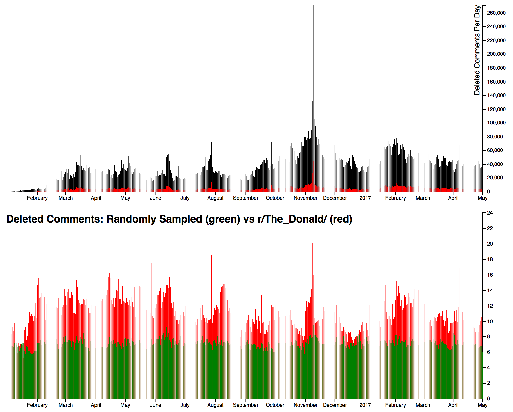
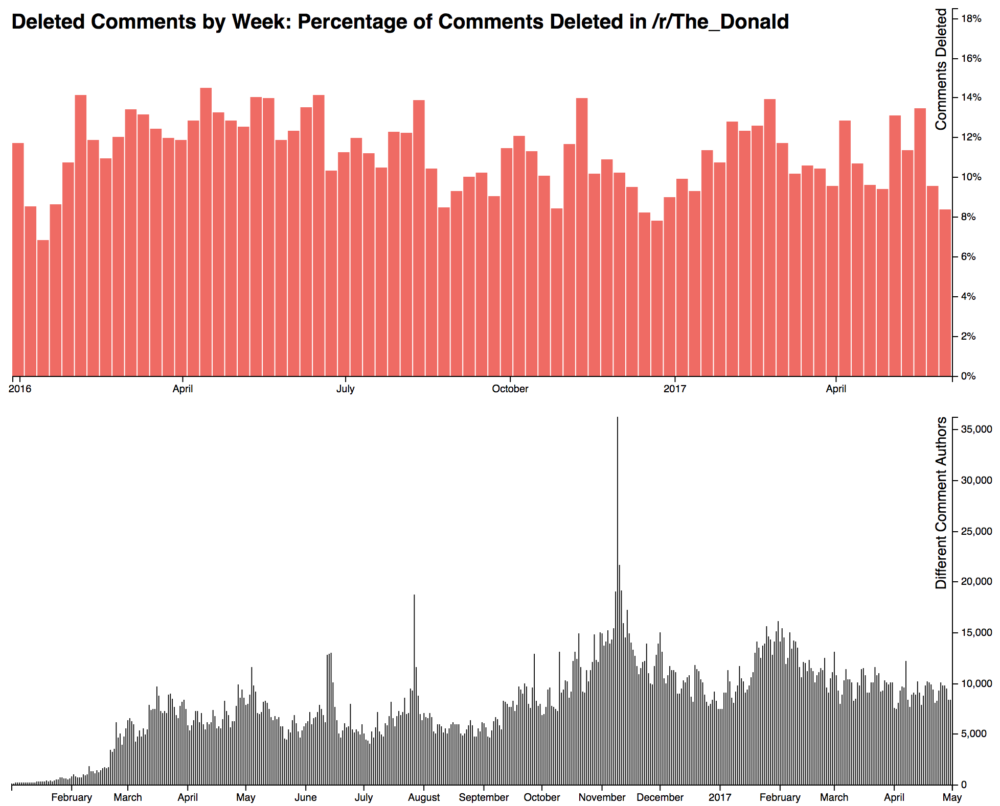

# reddit_graph

A bunch of hacked together d3 scripts to visualize some of the data from my [reddit_stats](https://github.com/jamesfe/reddit_stats) program.

It's important to note that this is not specific to one subreddit, you can run `reddit_stats` on any reddit you want and graph the results with this program.

# Running Things

```
npm install
npm run webpack
# In a separate terminal:
npm start
# now visit http://localhost:8080/public/
```

# Sample Graphs

Some sample graphs that this project has created:





# Contact Me

Twitter: [@jimmysthoughts](https://twitter.com/jimmysthoughts)
